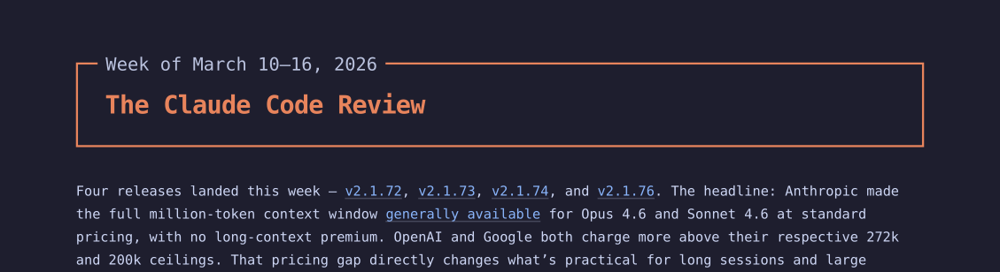

# cc-newsletter

A Claude Code plugin that creates fully automated newsletters by aggregating RSS feeds. Tell it what you want to write about, and it finds sources, collects content, and produces a finished newsletter on a recurring schedule.



## Install

Add the marketplace, then install the plugin:

```
/plugin marketplace add yahgwai/cc-newsletter
/plugin install cc-newsletter@yahgwai-cc-newsletter
```

## Quick start

Run the setup wizard. It walks you through choosing a subject, defining your sections, finding sources, and scheduling automated runs.

```
/cc-newsletter:setup
```

## How it works

The setup wizard helps you describe what your newsletter should cover and how it should read. Once configured, the plugin runs on a schedule:

1. Pulls new content from RSS feeds
2. Reads and summarizes each article
3. Picks the most relevant pieces for the current edition
4. Groups them by theme and writes the newsletter
5. Outputs the result as markdown and HTML

## Skills

The plugin provides three slash commands:

| Skill | Description |
|---|---|
| `/cc-newsletter:setup` | Interactive wizard that configures a new newsletter end-to-end |
| `/cc-newsletter:discover` | Find and add new content sources for an existing newsletter |
| `/cc-newsletter:reference` | CLI command reference for all available operations |
